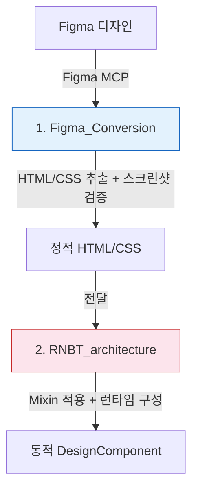
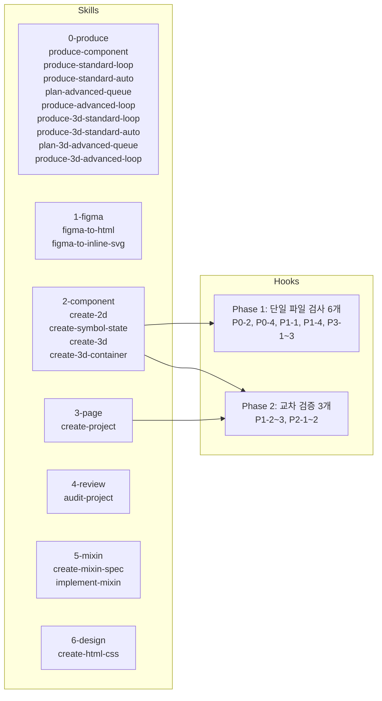

# CLAUDE.md

This file provides guidance to Claude Code when working in this repository.

## Repository Overview

이 저장소는 Figma 디자인을 웹 빌더 런타임 컴포넌트로 변환하는 두 개의 디렉토리로 구성됩니다.

| 디렉토리 | 역할 | Figma MCP |
|----------|------|-----------|
| **Figma_Conversion/** | Figma → 정적 HTML/CSS 추출 | 필요 |
| **RNBT_architecture/** | 정적 → 동적 컴포넌트 변환 + 런타임 | 불필요 |

---

## End-to-End Workflow





---

## SKILL 선택 가이드

### 컴포넌트 생산 (0-produce)

| 조건 | SKILL |
|------|-------|
| 새 컴포넌트를 처음부터 생산 (범주 확인 → 기능 분석 → Mixin 매핑 → 개발) | `produce-component` |
| 2D 컴포넌트 Standard를 폴더 알파벳 순으로 순차 생산 | `produce-standard-loop` |
| 2D 컴포넌트 Standard를 서브에이전트 기반 완전 자동 생산 | `produce-standard-auto` |
| 2D 컴포넌트 Advanced 변형 후보 발굴 → ADVANCED_QUEUE.md 등록 | `plan-advanced-queue` |
| 2D 컴포넌트 Advanced를 ADVANCED_QUEUE.md 순서대로 순차 생산 | `produce-advanced-loop` |
| 3D 컴포넌트 Standard를 models/ 알파벳 순으로 순차 생산 | `produce-3d-standard-loop` |
| 3D 컴포넌트 Standard를 models/ 알파벳 순 서브에이전트 기반 완전 자동 생산 | `produce-3d-standard-auto` |
| 3D 컴포넌트 Advanced 변형 후보 발굴 → ADVANCED_QUEUE.md 등록 | `plan-3d-advanced-queue` |
| 3D 컴포넌트 Advanced를 ADVANCED_QUEUE.md 순서대로 순차 생산 | `produce-3d-advanced-loop` |

`produce-component`는 전체 프로세스를 안내하며, 필요에 따라 아래 스킬들을 호출한다.

### Figma 변환 (1-figma)

| 조건 | SKILL |
|------|-------|
| 일반 HTML/CSS 변환 | `figma-to-html` |
| 런타임 색상 제어가 필요한 SVG 심볼/아이콘 | `figma-to-inline-svg` |

### 컴포넌트 생성 (2-component)

| 조건 | SKILL |
|------|-------|
| 페이지에서 데이터를 받아 표시 (차트, 테이블, 로그 등) | `create-2d-component` |
| SVG 심볼의 색상/상태를 런타임에서 제어 | `create-symbol-state-component` |
| 3D 개별 장비 (1 GLTF = 1 Mesh, meshName 확정) | `create-3d-component` |
| 3D GLTF 컨테이너 (1 GLTF = N Mesh, 동적 식별) | `create-3d-container-component` |
### 페이지 생성 (3-page)

| 조건 | SKILL |
|------|-------|
| 여러 컴포넌트를 조합한 대시보드 페이지 생성 | `create-project` |

### 점검 (4-review)

| 조건 | SKILL |
|------|-------|
| 프로젝트 전체의 구조/구현/문서/SKILL 일관성 종합 진단 | `audit-project` |

### Mixin 개발 (5-mixin)

| 조건 | SKILL |
|------|-------|
| 새 Mixin이 필요할 때 — 요구사항 분석 → 명세서 작성 | `create-mixin-spec` |
| 명세서가 승인된 후 — 구현 → 문서 → 동기화 | `implement-mixin` |

### 디자인 (6-design)

| 조건 | SKILL |
|------|-------|
| Figma 없이 HTML/CSS를 직접 작성 (디자이너 성향 기반) | `create-html-css` |

---

## 참조 문서

각 디렉토리는 독립적으로 작업 가능하며, 상세 문서를 포함합니다.
필요할 때 해당 파일을 읽어 참조하세요.

### 디렉토리별 지침

- **Figma 변환 지침**: `/Figma_Conversion/CLAUDE.md`
- **Figma 컴포넌트 구조**: `/Figma_Conversion/PUBLISHING_COMPONENT_STRUCTURE.md`
- **RNBT 변환 지침**: `/RNBT_architecture/CLAUDE.md`
- **RNBT 설계 문서**: `/RNBT_architecture/README.md`

### 코딩 & 구현 가이드

- **코딩 스타일**: `/.claude/guides/CODING_STYLE.md`
- **Figma 구현 가이드**: `/.claude/guides/FIGMA_IMPLEMENTATION_GUIDE.md`
- **Figma MCP 사용법**: `/.claude/guides/FIGMA_MCP_GUIDE.md`

### 운영 문서

- **Hook 설계 근거**: `/.claude/hooks/CLAUDE.md`
- **SKILL 공통 규칙**: `/.claude/skills/SHARED_INSTRUCTIONS.md`

---

## Claude Code 출력 규칙

**긴 텍스트 출력 시 코드 블록 사용** - 터미널에서 긴 한글 텍스트나 마크다운이 제대로 표시되지 않는 문제가 있음

- 코드 블록 (` ``` `)으로 감싼 내용: 정상 출력됨
- 일반 마크다운/한글 텍스트: 출력이 잘릴 수 있음
- 따라서 긴 문서 내용을 보여줄 때는 코드 블록으로 감싸서 출력할 것

---

## 답변 전 필수 확인 규칙

외부 용어/개념/도구에 답변할 때는 공식 문서로 먼저 확인하고, 확인할 수 없으면 "모른다"고 말한다. 확인 없이 해석하지 않는다.

**위반 징후:** "~일 것이다", "~로 보인다", 출처 없는 정의, 사용자 용어의 임의 재해석
**올바른 패턴:** "[용어]가 정확히 무엇인지 확인해보겠습니다" → 확인 → 답변

---

## 스크린샷 검토 원칙

스크린샷을 검토할 때 어림짐작하지 않는다. 시각적 문제(요소가 컨테이너를 벗어남, 정렬 어긋남, 크기 이상)를 정확히 식별하고 명확히 지적한다.

**금지 행위:** 대충 보고 "CSS는 정상", 명백한 레이아웃 문제를 무시하고 "문제없어 보입니다", 사용자가 지적한 후 "확인해보니 맞습니다"식 뒤늦은 인정
**올바른 패턴:** 각 요소를 구체적으로 확인하고 어떤 요소가 어떻게 잘못되었는지 명시 — 예: "카드가 stats-cards-container 바깥으로 약 20px 넘쳐 보입니다"

---

## 코드 작성 원칙

함수/메서드 사용 전 반드시 존재 여부를 확인한다. export 여부를 직접 확인하고, 유틸리티 함수명을 추측하지 않는다 (예: `unbindEvents` vs `removeCustomEvents`).

**금지 행위:** 존재하지 않는 함수 작성, 비슷한 이름 추측 사용, 실제 구현 확인 없이 호출 코드 작성
**올바른 패턴:** grep으로 확인 후 사용
```bash
grep "export.*functionName" Utils/*.js
grep "Wkit.functionName" Utils/Wkit.js
```

---

## 사용자 피드백 검증 원칙

사용자가 "동작하지 않는다", "문제있다"고 말해도 실제 코드/동작을 직접 확인한다. 무조건 따르지 않고 사실에 기반해 정직하게 답변한다.

**금지 행위:** 확인 없이 바로 수정, 추측으로 원인 진단·수정, 사용자 말에 맞추려 실제와 다른 설명
**올바른 패턴:** "확인해보겠습니다" → 실제 코드 확인 → 사실에 기반한 답변
- 문제없으면: "코드 확인 결과 [이유]로 정상 동작해야 합니다"
- 문제있으면: "[구체적 원인]이 문제입니다. [해결책]으로 수정하겠습니다"

---

## Git 충돌 처리 원칙

**Git 충돌 발생 시 임의로 해결하지 않는다.**

1. 충돌 상황을 즉시 사용자에게 보고한다
2. 충돌 내용(어떤 파일, 어떤 브랜치 간)을 명확히 설명한다
3. 사용자의 지시를 받은 후에만 해결 작업을 진행한다

**금지 행위:**
- `git stash`, `git reset`, `git rebase` 등을 임의로 실행
- 충돌 마커를 임의로 편집하여 해결
- 사용자 확인 없이 merge 전략 선택

---

## 작업 태도

차분하고 꼼꼼하게 작업한다. 급하게 결과를 내지 않고 한 단계씩 확실히 완료한 후 다음으로 넘어간다. 문서는 처음부터 끝까지 상세하게, 코드는 의도와 동작을 명확히 이해한 후 작성한다.

**올바른 패턴:** 복잡한 작업은 TodoWrite로 단계 추적, 각 단계 완료 후 결과 확인, 문서는 독자가 모든 맥락을 모른다고 가정하고 작성, "빠르게"보다 "정확하게" 우선

---

*최종 업데이트: 2026-04-16*
